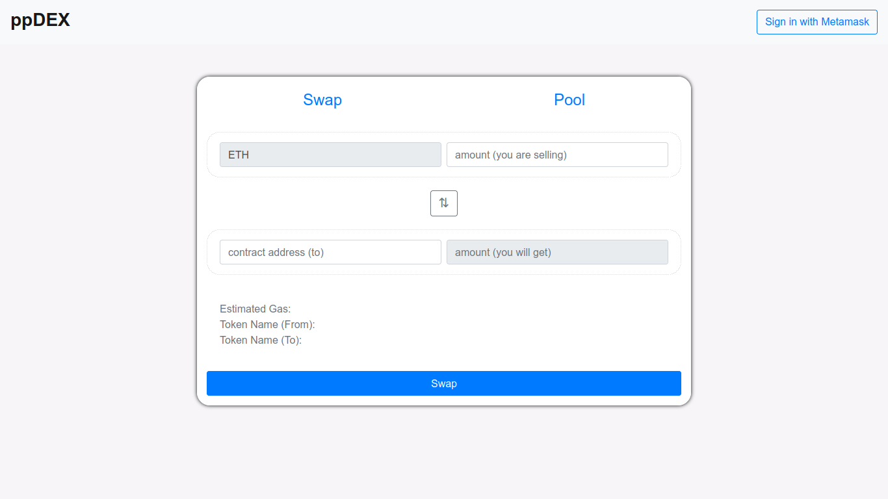

</br>

   


# ppDEX 
[Website](http://ppdex.herokuapp.com/)
> Decentralised Exchange hosted on Ethereum Testnet

---


### Table of Contents

- [ppDEX](#ppdex)
    - [Table of Contents](#table-of-contents)
  - [Introduction](#introduction)
      - [Basic Terminology and Definitions](#basic-terminology-and-definitions)
      - [Project Structure](#project-structure)
      - [Technologies](#technologies)
  - [How It Works](#how-it-works)
      - [Creating Exchanges](#creating-exchanges)
      - [Setting Prices](#setting-prices)
      - [ETH &#8652; ERC20 Tokens](#eth--erc20-tokens)
      - [Providing Liquidity](#providing-liquidity)
      - [Fee Structure](#fee-structure)
  - [Future Additions](#future-additions)
  - [Installation](#installation)
  - [References](#references)
  - [Author Info](#author-info)
      - [Prakhar Pandey](#prakhar-pandey)
      - [Pratham Pekamwar](#pratham-pekamwar)
  - [License](#license)

---

## Introduction


ppDEX is a protocol for automated token exchange on Ethereum. It is designed around
ease-of-use, censorship resistance, and zero rent extraction. It is useful for
traders and functions particularily well as a component of other smart contracts which
require guaranteed on-chain liquidity.

---


---
#### Basic Terminology and Definitions

- Ethereum - The blockchain platform used by ppDEX. Read [here](https://ethereum.org/).
- ERC20 - [Ethereum Standard Token](https://ethereum.org/en/developers/docs/standards/tokens/erc-20/)
- ETH - [Ether](https://ethereum.org/en/eth/)
- Smart Contract - A computer program written in Solidity, for Ethereum, that ensures credibility of the decentralized exchange. Read [Wiki](https://en.wikipedia.org/wiki/Smart_contract).
- Liquidity - Measure of how fluidly the token can be exchanged.
- Liquidity Pool - Pool of tokens locked in a smart contract.


#### Project Structure
- [README.md](README.md) : README file for the project. Contains project description, table of contents, and installation instructions.
- [LICENSE](LICENSE) : LICENSE file .
- [assets](assets) : Assets folder containing images, logos, and other assets.
- [contracts](contracts) : Contracts folder containing smart contracts.
- [src](src) : Source folder containing the HTML, CSS, and JavaScript files for the project. Majorly used for the front-end.
- [build](build) : Build folder containing the compiled files for the project. Majorly used for the back-end i.e. deploying the smart contracts to the blockchain.
- [tests](tests) : Tests folder containing unit tests for the project.


#### Technologies

- Front End: HTML, CSS (+ BootStrap) , JavaScript (+ Jquery)
- Browser-Block Chain Connectivity: MetaMask, Web3.js
- Back End: Solidity, Ganache + Truffle (Local Network) (current), Rinkeby

[Back To The Top](#ppdex)

---

## How It Works

Visit site [here](https://ppdex.herokuapp.com). (Note that the website may not be updated to the latest version yet.)
or build a local instance of the website using the instructions given [here](#installation). (Recommended for the most recent version)


#### Creating Exchanges
 [ppSwapExchangeCreator](contracts/ppdex.sol) is a smart contract that serves as both a factory and registry for ppDEX exchanges. The public function launchExchange() allows any Ethereum user to deploy an exchange contract for any ERC20 that does not already have one.
 Following is the implementation of the same

``` solidity
function launchExchange(address _token) public returns (address exchange) {
    require(tokenToExchange[_token] == address(0));             //There can only be one exchange per token
    require(_token != address(0) && _token != address(this));
    ppSwap newExchange = new ppSwap(_token);
    tokenList.push(_token);
    tokenToExchange[_token] = address(newExchange);
    exchangeToToken[address(newExchange)] = _token;
    emit ExchangeLaunch(address(newExchange), _token);
    return address(newExchange);
}

```

#### Setting Prices

Prices are set automatically using the constant product
[`x*y=k`](https://ethresear.ch/t/improving-front-running-resistance-of-x-y-k-market-makers/1281) market maker mechanism, which keeps overall reserves in relative equilibrium. Reserves are
pooled between a network of liquidity providers who supply the system with tokens in exchange for a proportional share of transaction (provided through liquidity tokens) .
Following is the implementation for the same

``` solidity
uint256 TokenPool = invariant.div(EthPool);
```

Note: Here `div` is just a function that divides two numbers but in a safe manner, i.e. it does not divide by zero. Invariant is the k value in the above equation. EthPool is the amount of ETH in the pool. TokenPool is the amount of tokens in the pool.


#### ETH &#8652; ERC20 Tokens

Each exchange contract [ppSwap](contracts/ppdex.sol) is associated with a single ERC20 token and holds a liquidity pool of both ETH and that token. The exchange rate between ETH and an ERC20 is based on the relative sizes of their liquidity pools within the contract. This is done by maintaining the relationship eth_pool * token_pool = invariant. This invariant is held constant during trades and only changes when liquidity is added or removed from the market.

A simplified version of ethToToken(), the function for converting ETH to ERC20 tokens, is shown below:


``` solidity
function ethToToken(
  address buyer,
  address recipient,
  uint256 ethIn,
  uint256 minTokensOut
)
  internal
  exchangeInitialized
{
  uint256 fee = ethIn.div(FEE_RATE);
  uint256 newEthPool = ethPool.add(ethIn);
  uint256 tempEthPool = newEthPool.sub(fee);
  uint256 newTokenPool = invariant.div(tempEthPool);
  uint256 tokensOut = tokenPool.sub(newTokenPool);
  require(tokensOut >= minTokensOut && tokensOut <= tokenPool);
  ethPool = newEthPool;
  tokenPool = newTokenPool;
  invariant = newEthPool.mul(newTokenPool);
  emit EthToTokenPurchase(buyer, ethIn, tokensOut);
  require(token.transfer(recipient, tokensOut));
}
```


#### Providing Liquidity

Adding liquidity requires depositing an equivalent value of ETH and ERC20 tokens into the ERC20 token’s associated exchange contract.

The first liquidity provider to join a pool sets the initial exchange rate by depositing what they believe to be an equivalent value of ETH and ERC20 tokens. If this ratio is off, arbitrage traders will bring the prices to equilibrium at the expense of the initial liquidity provider.

The first liquidity can be provided using the following function initializeExchange():

``` solidity
function initializeExchange(uint256 _tokenAmount) external payable {
  require(invariant == 0 && totalLpTokens == 0);
  require(msg.value != 0 && _tokenAmount != 0);
  ethPool = msg.value;
  tokenPool = _tokenAmount;
  invariant = ethPool.mul(tokenPool);
  lpTokens[msg.sender] = 10000;
  totalLpTokens = 10000;
  require(token.transferFrom(msg.sender, address(this), _tokenAmount));
}
```

All future liquidity providers deposit ETH and ERC20’s using the exchange rate at the moment of their deposit. If the exchange rate is bad there is a profitable arbitrage opportunity that will correct the price.

Liquidity tokens are minted to track the relative proportion of total reserves that each liquidity provider has contributed. They are highly divisible and can be burned at any time to return a proporitonal share of the markets liquidity to the provider.

Liquidity providers call the addLiquidity() function to deposit into the reserves and mint new liquidity tokens:


``` solidity
function investLiquidity(
  uint256 _minlpTokens
)
  external
  payable
  exchangeInitialized
{
  require(msg.value > 0 && _minlpTokens > 0);
  uint256 ethPerLpToken = ethPool.div(totalLpTokens);
  require(msg.value >= ethPerLpToken);
  uint256 lpTokensPurchased = msg.value.div(ethPerLpToken);
  require(lpTokensPurchased >= _minlpTokens);
  uint256 tokensPerLpToken = tokenPool.div(totalLpTokens);
  uint256 tokensRequired = lpTokensPurchased.mul(tokensPerLpToken);
  lpTokens[msg.sender] = lpTokens[msg.sender].add(lpTokensPurchased);
  totalLpTokens = totalLpTokens.add(lpTokensPurchased);
  ethPool = ethPool.add(msg.value);
  tokenPool = tokenPool.add(tokensRequired);
  invariant = ethPool.mul(tokenPool);
  emit ProvidingLiquidity(msg.sender, lpTokensPurchased);
  require(token.transferFrom(msg.sender, address(this), tokensRequired));
}
```

Similar Function exists for removing liquidity

#### Fee Structure

- ETH to ERC20 trades
0.2% fee paid in ETH
- ERC20 to ETH trades
0.2% fee paid in ERC20 tokens


[Back To The Top](#ppdex)


---
## Future Additions
- Support for ERC20 &#8652; ERC20 exchange

---

## Installation

- Step 1: Clone this repository into your local machine. (See [here](https://docs.github.com/en/repositories/creating-and-managing-repositories/cloning-a-repository))
- Step 2: Install Node.js and npm. (See [here](https://nodejs.org/en/download/))
- Step 3: Install Truffle. (See [here](https://trufflesuite.com/docs/truffle/getting-started/installation/))
- Step 4: Install Ganache. (See [here](https://trufflesuite.com/docs/ganache/))
- Step 5: Install Metamask extension. (See [here](https://metamask.io/))
- Step 6: Run Ganache and Configure Metamask for the local network. (See [here](https://metamask.io/docs/guide/ethereum-setup.html))
- Step 7: Run the following command in the project directory:
    ```
    npm install
    ```
- Step 8: Run the following command in the project directory:
    ```
    npm run dev
    ```
- Step 9: Open the browser and navigate to the localhost:3000

[Back To The Top](#ppdex)

---

## References

- Ethereum - [Ethereum](https://ethereum.org/en/eth/)
- Solidity - [Solidity](https://solidity.readthedocs.io/en/latest/)
- Truffle - [Truffle](https://truffleframework.com/)
- ERC20 - [Ethereum Standard Token](https://ethereum.org/en/developers/docs/standards/tokens/erc-20/)
- Decentralized Applications - [Whiteboard Crypto](https://youtu.be/oPIupbsVimc) (YouTube), [Wiki](https://en.wikipedia.org/wiki/Decentralized_application) (Wikipedia)
- Smart Contracts - [Whiteboard Crypto](https://youtu.be/pyaIppMhuic) (YouTube), [Wiki](https://en.wikipedia.org/wiki/Smart_contract) (Wikipedia)
- Liquidity Pool - [Whiteboard Crypto](https://www.youtube.com/watch?v=dVJzcFDo498) (YouTube)

[Back To The Top](#ppdex)

---

## Author Info

#### Prakhar Pandey

- Email - [prakhar.pandey@iitg.ac.in](mailto:prakhar.pandey@iitg.ac.in)
- Github - [p-prakhar](https://github.com/p-prakhar)

#### Pratham Pekamwar

- Email - [p.pratham@iitg.ac.in](mailto:p.pratham@iitg.ac.in)
- Github - [PrathamPekamwar](https://github.com/PrathamPekamwar)
  
  [Back To The Top](#ppdex)

---

## License

- MIT License (MIT) (Truffle) - [MIT License](LICENSE)

    [Back To The Top](#ppdex)
---
